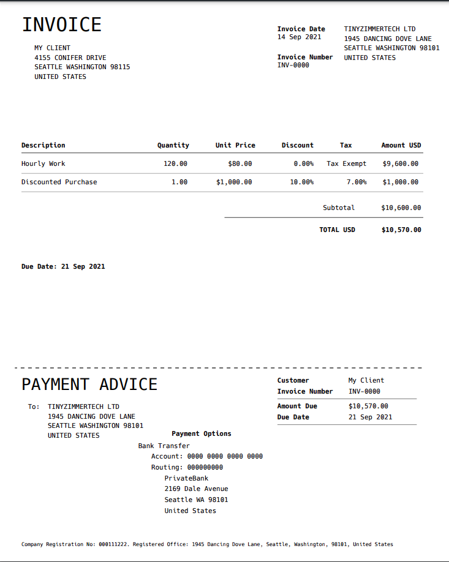

# ginvoicer

A command line utility and library for generating professional looking invoices in Go.

[](https://pkg.go.dev/github.com/tinyzimmer/ginvoicer)

This is a very rough draft and there could still be bugs.

## CLI Usage

You can download the CLI from the [releases](https://github.com/tinyzimmer/ginvoicer/releases) page or build it yourself by cloning this repository and running `make`.

The CLI currently requires a YAML configuration (by default at `~/.ginvoicer/config.yaml`).
The configuration is not well documented yet, but there is a sample [here](config.yaml.sample) and you can view the model [here](pkg/types/config.go).

Once you have a configuration, you can generate invoices easily with:

```bash
ginvoicer -c config.yaml.sample generate \
    --payer my-client \
    --item hourly=120 \
    --item discounted-purchase=1

Invoice written to INV-0000.pdf
```

The invoice generated from the above command can be seen [here](examples/invoice.pdf).

<details>
    <summary>Click to see a zoomed out image</summary>


</details>


Invoice numbers will auto-increment based on your configuration `directory` unless specified explicitly with the `--number` flag.

```bash
ginvoicer -c config.yaml.sample generate \
    --payer my-client \
    --item monthly=1 \
    --item taxed-hourly=120

Invoice written to INV-0001.pdf
```

## Library Usage

The library is pretty straightforward. The configurations from the CLI usage are largely passed directly to the builder. A simple example looks like this:

```go
package main

import (
	"io"
	"os"
	"time"

	"github.com/tinyzimmer/ginvoicer/pkg/invoice"
	"github.com/tinyzimmer/ginvoicer/pkg/types"
)

func main() {
    // The library is structured to potentially support various
    // output formats in the future. For now, only PDF is supported.
    builder, err := invoice.NewBuilder(types.BuildOutputPDF)
    if err != nil {
        panic(err)
    }

    // The details used to build the invoice
    info := &types.InvoiceDetails{
        InvoiceNumber: "INV-0001",
        InvoiceDate:   time.Now(),
        DueDate:       time.Now().AddDate(0, 0, 7),
        Payee: &types.Entity{
            Address: &types.Address{
                Name:    "My Business",
                Address: "1234 Clover Lane",
                City:    "New York", State: "NY",
                ZipCode: "10036",
            },
            RegistrationNo: "123456789",
            BankAccount: &types.BankAccount{
                Address: &types.Address{
                    Name:    "My Bank",
                    Address: "221b Baker Street",
                    City:    "London", Country: "UK",
                    ZipCode: "WC2N 5DU",
                },
                AccountNumber: "0000 1111 2222 3333",
                RoutingNumber: "123456789",
            },
        },
        Payer: &types.Entity{
            Address: &types.Address{
                Name:    "My Client",
                Address: "177A Bleecker Street",
                City:    "New York", State: "NY",
                ZipCode: "10036",
            },
        },
        Items: types.BillableList{
            {
                Description: "Hourly Work",
                Quantity:    100,
                UnitPrice:   50,
            },
        },
    }

    if err := builder.BuildInvoice(info); err != nil {
        panic(err)
    }

    // The builder can either be used as a Reader or
    // dumped via the WriteFile method.
    f, err := os.Create("invoice.pdf")
    if err != nil {
        panic(err)
    }
    io.Copy(f, builder)

    // OR

    if err := builder.WriteFile("invoice.pdf"); err != nil {
        panic(err)
    }
}
```